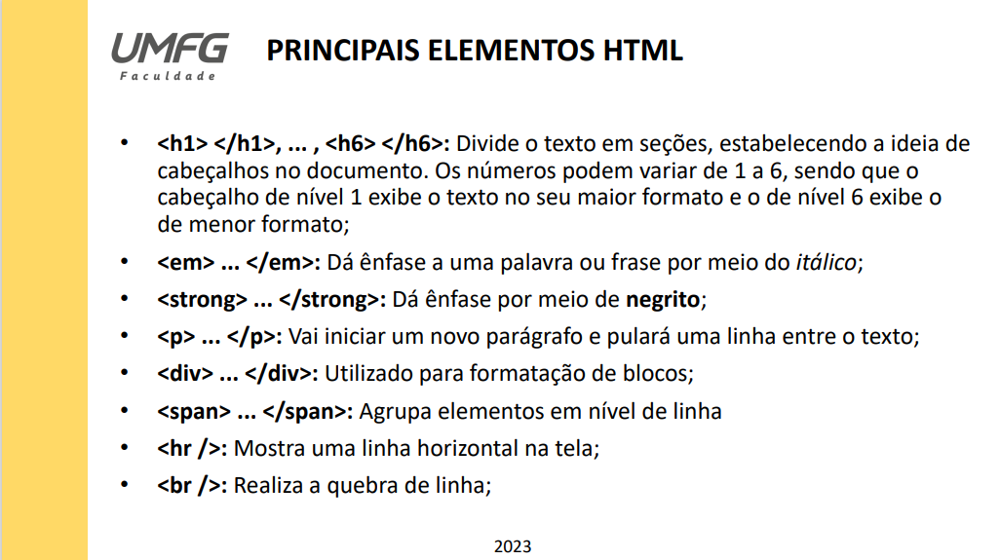
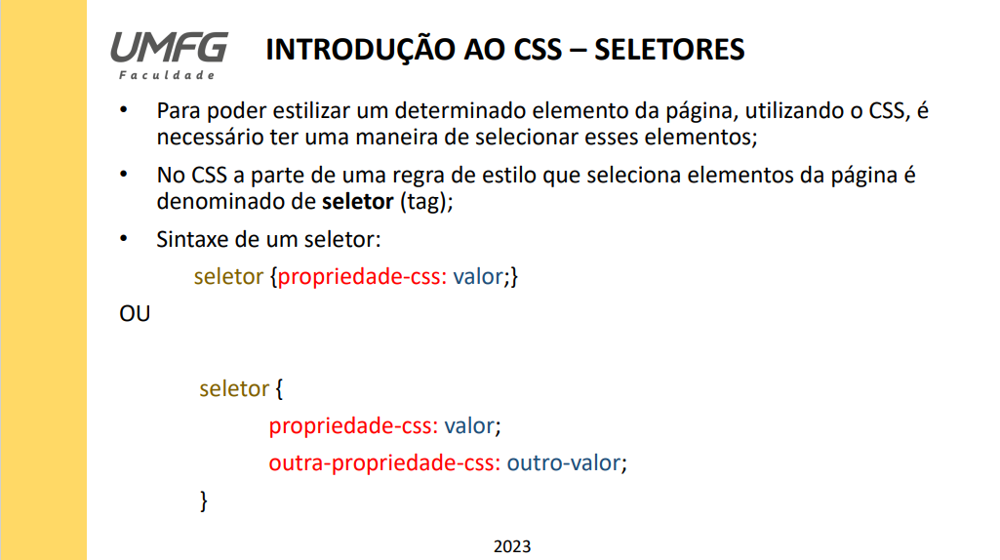
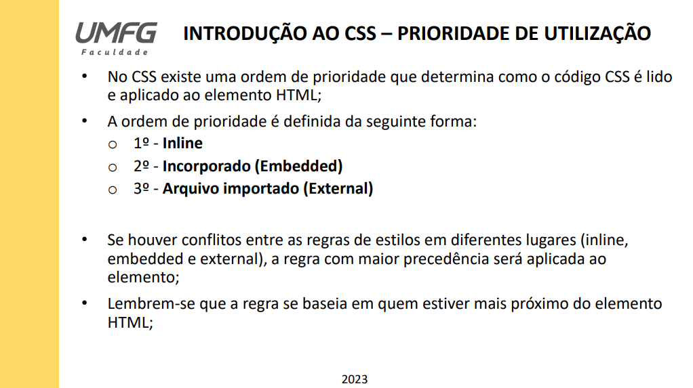
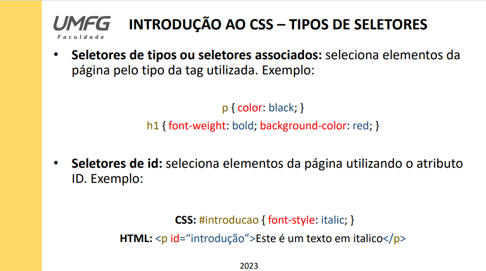
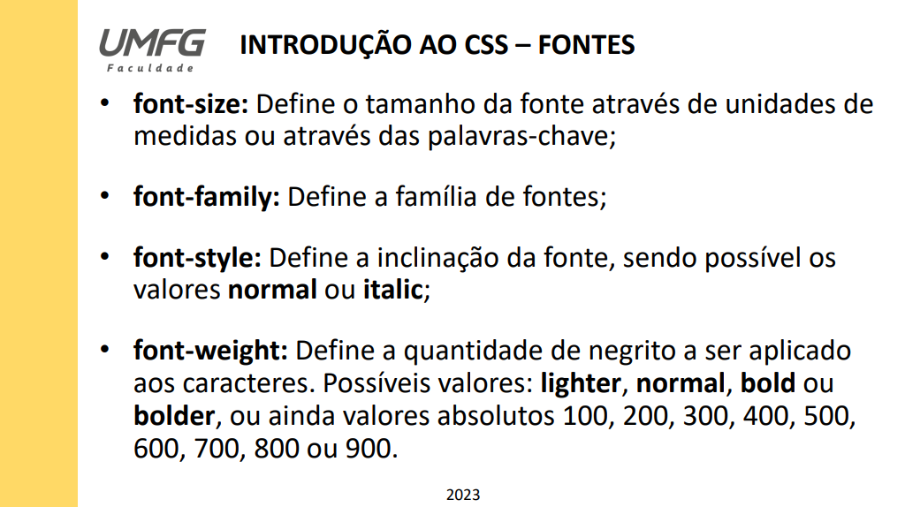
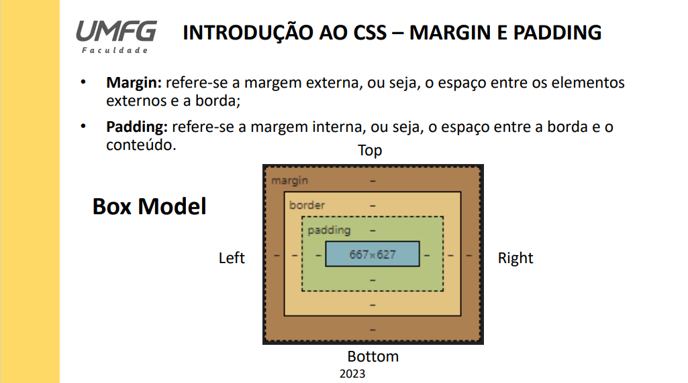

# Elementos HTML e CSS

## Aula 01 - Conceitos básicos de HTML e Introdução a Seletores CSS

Foi desenvolvido um arquivo index.html inicial para ser desenvolvido durante a aula com os alunos, para explicar novamente cada comportamento
das tags básicas mais utilizadas do HTML. Podemos verificar isso conforme o slide apresentado em aula mencionado abaixo:

  Posteriormente, foi introduzido o conceito de CSS e a noção de seletores, apresentando as prioridades de estilização. Podemos verificar isso
conforme os slides abaixo:

## Aula 02 - Continuação sobre Seletores CSS, Formatações de texto e Box-Model

No mesmo arquivo index.html desenvolvemos mais funções onde tratamos com maiores detalhes os seletores associados por classes e a importação de estilização via arquivo style.css. Esses seletores seguem conforme vimos em sala de aula nos slides abaixo:

Também utilizamos de algumas ferramentas de formatações de texto conforme demonstrado na imagem abaixo:

Por fim, paramos no meio da explicação do que é um Box-Model e como ele se comporta:

